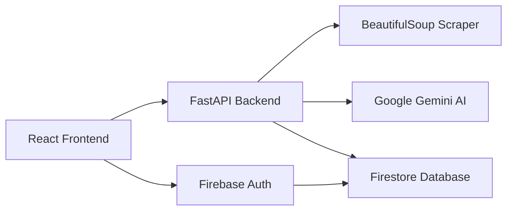

# AI SMS Ad Generator

A full-stack web application that leverages Google Gemini AI to generate high-quality, context-aware SMS ad drafts. Features a **Campaign Management Dashboard** for managing clients and campaigns, **Firebase Authentication** with email verification, and intelligent website scraping to understand product context.

---

## 📑 Table of Contents

- [Quick Start](#-quick-start)
- [Features](#-features)
- [High-Level Architecture](#-high-level-architecture)
- [API Documentation](#-api-documentation)
- [Folder Structure](#-folder-structure)
- [Known Limitations](#-known-limitations)
- [License](#-license)

---

## 🚀 Quick Start

### Prerequisites
- **Node.js** (v18+)
- **Python** (v3.10+)
- **Google Gemini API Key** ([Google AI Studio](https://aistudio.google.com/))
- **Firebase Project** ([Firebase Console](https://console.firebase.google.com/))

### Backend Setup
1. Navigate to the backend directory:
   ```bash
   cd backend
   ```
2. Create a virtual environment:
   ```bash
   python -m venv venv
   source venv/Scripts/activate  # Windows
   # or
   source venv/bin/activate      # Mac/Linux
   ```
3. Install dependencies:
   ```bash
   pip install -r requirements.txt
   ```
4. Configure environment:
   Create a `.env` file in the `backend` folder:
   ```env
   GEMINI_API_KEY=your_gemini_api_key
   FIREBASE_SERVICE_ACCOUNT_PATH=./serviceAccountKey.json
   ```
5. Add your Firebase service account key file (`serviceAccountKey.json`) to the backend folder.
6. Run the server:
   ```bash
   uvicorn app.main:app --reload
   ```

### Frontend Setup
1. Navigate to the frontend directory:
   ```bash
   cd frontend
   ```
2. Install dependencies:
   ```bash
   npm install
   ```
3. Configure environment:
   Create a `.env` file in the `frontend` folder:
   ```env
   VITE_API_BASE_URL=http://localhost:8000
   VITE_FIREBASE_API_KEY=your_firebase_api_key
   VITE_FIREBASE_AUTH_DOMAIN=your-project-id.firebaseapp.com
   VITE_FIREBASE_PROJECT_ID=your-project-id
   VITE_FIREBASE_STORAGE_BUCKET=your-project-id.appspot.com
   VITE_FIREBASE_MESSAGING_SENDER_ID=your_sender_id
   VITE_FIREBASE_APP_ID=your_app_id
   ```
4. Run the development server:
   ```bash
   npm run dev
   ```
5. Open [http://localhost:5173](http://localhost:5173) in your browser.

> 📘 For detailed setup instructions including Firebase configuration, see [SETUP_GUIDE.md](./SETUP_GUIDE.md).

---

## 🛠 Features

### Core Features
- **AI-Powered SMS Generation**: Context-aware SMS drafts using Google Gemini AI
- **Website Scraping**: Automatically extracts product details and brand voice from target websites
- **Phone Number Extraction**: Identifies primary contact numbers from websites

### Dashboard & Analytics (Overview Page)
- **Overview Dashboard**: Visual statistics with active campaigns, total customers, and SMS counts
- **Dynamic Analytics**: Real-time trend indicators showing campaign growth
- **Recent Activities**: Quick access to last 5 campaign activities
- **Quick Actions**: Start new campaigns or add customers directly

### Customer Management
- **Customer List**: Organized display with search, sorting, and filtering
- **Customer Cards**: Quick access to start campaigns for any customer
- **Add/Edit Customers**: Create and manage customer profiles with automatic logo extraction
- **Sorting Options**: Alphabetical, Recently Added, First Added, Recently Operated
- **Filtering Options**: By campaign status (Active, Planned, Draft, Completed)

### Campaign Management
- **Campaign List**: View all campaigns with status badges and progress indicators
- **Campaign Details**: Detailed view with products, discount, dates, and generated SMS
- **Create Campaigns**: Associate campaigns with customers, set dates and products
- **Automated Status**: Campaigns auto-update (Taslak → Planlandı → Aktif → Tamamlandı)
- **Date Validation**: Smart validation preventing invalid date ranges
- **Sorting & Filtering**: Multiple options to organize campaign list

### Authentication & Security
- **Firebase Authentication**: Secure login with Email/Password
- **Email Verification**: Required verification before accessing dashboard
- **Forgot Password**: Password reset via email with modal dialog
- **Google Sign-In**: One-click authentication with Google accounts
- **User Settings**: Change display name and password
- **Protected Routes**: All features require verified authentication

### SMS Generation Features
- **Dynamic Draft Count**: Generate 1-10 distinct SMS drafts per request
- **Audience Targeting**: Customize tone based on target audience tags
- **Turkish Support**: Native support for Turkish language and date formatting
- **Campaign Dates**: Configurable start and end dates with smart validation
- **Rate-Limit Resilience**: Built-in retry logic for API quotas

---

## 🏗 High-Level Architecture

The application follows a modern decoupled architecture with Firebase integration:



### Tech Stack
| Layer | Technologies |
|-------|-------------|
| **Frontend** | React, Vite, TailwindCSS |
| **Backend** | FastAPI (Python), httpx |
| **AI** | Google Generative AI (Gemini SDK) |
| **Authentication** | Firebase Auth |
| **Database** | Cloud Firestore |
| **Scraping** | BeautifulSoup4 |

---

## 🔌 API Documentation

### Authentication Endpoints
| Method | Endpoint | Description |
|--------|----------|-------------|
| `POST` | `/auth/verify-token` | Verify Firebase ID token |
| `GET` | `/auth/user` | Get current user profile (protected) |

### Customer Endpoints (Protected)
| Method | Endpoint | Description |
|--------|----------|-------------|
| `GET` | `/customers` | List all customers |
| `POST` | `/customers` | Create a new customer |
| `GET` | `/customers/{id}` | Get single customer |
| `PUT` | `/customers/{id}` | Update customer |
| `DELETE` | `/customers/{id}` | Delete customer |

### Campaign Endpoints (Protected)
| Method | Endpoint | Description |
|--------|----------|-------------|
| `GET` | `/campaigns` | List all campaigns |
| `POST` | `/campaigns` | Create a new campaign |
| `GET` | `/campaigns/{id}` | Get single campaign |
| `PUT` | `/campaigns/{id}` | Update campaign |
| `DELETE` | `/campaigns/{id}` | Delete campaign |

### SMS Generation
| Method | Endpoint | Description |
|--------|----------|-------------|
| `POST` | `/generate-sms` | Generate SMS ad drafts |

#### Generate SMS Request Example
```json
{
  "website_url": "https://example.com",
  "products": ["Product A", "Product B"],
  "discount_rate": 20,
  "message_count": 3,
  "target_audience": "Gençler",
  "start_date": "2026-02-01",
  "end_date": "2026-02-15",
  "phone_number": "+90 555 123 4567"
}
```

#### Generate SMS Response Example
```json
{
  "drafts": [
    {
      "type": "Klasik",
      "content": "Harika fırsat! Product A şimdi %20 indirimle..."
    },
    {
      "type": "Acil",
      "content": "SON ŞANS! Kampanya 15.02.2026 tarihinde bitiyor..."
    }
  ]
}
```

> 📘 For more API examples, see [API_EXAMPLES.md](./API_EXAMPLES.md).

---

## 📁 Folder Structure

```
.
├── backend/
│   ├── app/
│   │   ├── controllers/      # API Routers (auth, customer, campaign, sms)
│   │   ├── services/         # Business logic (scraping, AI prompts, CRUD ops)
│   │   ├── clients/          # Gemini API client
│   │   ├── models/           # Pydantic request/response schemas
│   │   ├── config/           # Environment settings, Firebase config
│   │   └── middleware/       # Auth middleware
│   ├── serviceAccountKey.json  # Firebase Admin SDK (gitignored)
│   └── requirements.txt
└── frontend/
    ├── src/
    │   ├── pages/            # Overview, Customers, Campaigns, Login, etc.
    │   ├── contexts/         # AuthContext (Firebase auth state)
    │   ├── components/       # Layout, Modal, Cards, ForgotPasswordModal
    │   ├── services/         # API service layer
    │   └── config/           # Firebase SDK config
    └── package.json
```

---

## ⚠️ Known Limitations

### Cloudflare Bot Protection
Websites protected by advanced bot detection systems (like Cloudflare) may return a `403 Forbidden` error during scraping.
- **Impact**: Cannot read product context or extract phone numbers
- **Handling**: AI generates generic drafts based on manual input

### Gemini Rate Limits (RPM)
Free-tier API keys have strict limits (15 RPM or lower).
- **Impact**: Rapid requests may trigger "429 Too Many Requests"
- **Handling**: Backend includes 5-second automatic retry logic

### IDN/Non-ASCII URLs
International domain names are supported via automatic Punycode conversion.

---

## 📸 Screenshots

> **TODO**: Add screenshots of key features here:
> 1. Login Page - `docs/screenshots/login.png`
> 2. Overview Dashboard - `docs/screenshots/overview.png`
> 3. Customer List - `docs/screenshots/customers.png`
> 4. Campaign Details - `docs/screenshots/campaign-details.png`
> 5. SMS Generator - `docs/screenshots/sms-generator.png`

---

## ⚖️ License
Internal evaluation project.
