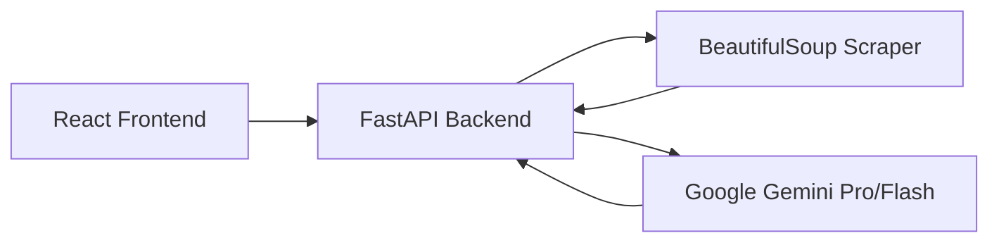

# AI SMS Ad Generator

A full-stack web application that leverages Google Gemini AI to generate high-quality, context-aware SMS ad drafts. The system scrapes target websites to understand product context and automatically identifies the best contact phone number for the campaign.

---

## � Table of Contents

- [Quick Start](#-quick-start)
- [Features](#-features)
- [High-Level Architecture](#-high-level-architecture)
- [API Documentation](#-api-documentation)
- [Folder Structure](#-folder-structure)
- [Known Limitations](#-known-limitations)
- [License](#-license)

---

## �🚀 Quick Start

### Prerequisites
- **Node.js** (v18+)
- **Python** (v3.10+)
- **Google Gemini API Key** (Accessible via [Google AI Studio](https://aistudio.google.com/))

### Backend Setup
1. Navigate to the backend directory:
   ```bash
   cd backend
   ```
2. Create a virtual environment:
   ```bash
   python -m venv venv
   source venv/Scripts/activate  # Windows
   # or
   source venv/bin/activate      # Mac/Linux
   ```
3. Install dependencies:
   ```bash
   pip install -r requirements.txt
   ```
4. Configure environment:
   Create a `.env` file in the `backend` folder:
   ```env
   GEMINI_API_KEY=your_api_key_here
   ```
5. Run the server:
   ```bash
   uvicorn app.main:app --reload
   ```

### Frontend Setup
1. Navigate to the frontend directory:
   ```bash
   cd frontend
   ```
2. Install dependencies:
   ```bash
   npm install
   ```
3. Run the development server:
   ```bash
   npm run dev
   ```
4. Open [http://localhost:5173](http://localhost:5173) in your browser.

---

## 🛠 Features

- **Context-Aware Generation**: Automatically scrapes the target website to understand product details and brand voice.
- **AI-Powered Phone Extraction**: Identifies the primary customer service number from the website (footer, contact page).
- **Dynamic Draft Count**: Generate between 1 and 10 distinct SMS drafts in a single request.
- **Audience Targeting**: Customizes tone and language based on target audience tags (e.g., "Students", "Luxury Buyers").
- **Turkish Support**: Native support for Turkish language and date formatting (including year enforcement).
- **Rate-Limit Resilience**: Built-in retry logic to handle Gemini API per-minute quotas.

---

## 🏗 High-Level Architecture

The application follows a modern decoupled architecture:

1. **Frontend (React)**: Collects campaign parameters and user preferences via a dynamic UI.
2. **Backend (FastAPI)**: 
   - orchestrates the scraping process using `BeautifulSoup`.
   - Analyzes raw text and candidate numbers using AI JSON mode.
   - Builds custom prompts for SMS generation.
3. **AI Provider (Gemini)**: Acts as the creative engine for text generation and structured data analysis.



### Tech Stack
- **Frontend**: React, Vite, Vanilla CSS.
- **Backend**: FastAPI (Python), httpx.
- **AI**: Google Generative AI (Gemini SDK).
- **Scraping**: BeautifulSoup4.

---

## 🔌 API Documentation

### Generate SMS Drafts
**Endpoint**: `POST /generate-sms`

**Request Body**:
```json
{
  "website_url": "https://example.com",
  "products": ["Product A", "Product B"],
  "discount_rate": 20,
  "message_count": 3,
  "target_audience": "Gençler",
  "start_date": "2026-02-01",
  "end_date": "2026-02-15"
}
```

**Response Body**:
```json
{
  "drafts": [
    {
      "type": "Klasik",
      "content": "Harika fırsat! Product A şimdi %20 indirimle..."
    },
    {
       "type": "Acil",
       "content": "SON ŞANS! Kampanya 15.02.2026 tarihinde bitiyor..."
    }
  ]
}
```

---

## 📝 Folder Structure

```
.
├── backend/
│   ├── app/
│   │   ├── controllers/   # API Routers
│   │   ├── services/      # Business logic (Scraping + AI prompt building)
│   │   ├── clients/       # Gemini API client
│   │   ├── models/        # Pydantic request/response schemas
│   │   └── config/        # Env settings
│   └── requirements.txt
└── frontend/
    ├── src/
    │   ├── pages/         # Home page logic
    │   ├── services/      # Axios API service
    │   └── components/    # UI elements
    └── package.json
```

---

## ⚠️ Known Limitations

### Cloudflare Bot Protection
Websites protected by advanced bot detection systems (like Cloudflare) may return a `403 Forbidden` error during the scraping process. 
- **Impact**: The system will not be able to read product context or extract phone numbers for these specific sites.
- **Handling**: In these cases, the AI will generate generic drafts based on your manual input and may omit the phone number (falling back to "Belirtilmedi").

### Gemini Rate Limits (RPM)
Free-tier API keys have a strict limit of 15 Requests Per Minute (RPM) or lower.
- **Impact**: Rapid successive generations might trigger "429 Too Many Requests".
- **Handling**: The backend includes a 5-second automatic retry logic for transient 429 errors.

---

## ⚖️ License
Internal evaluation project.
