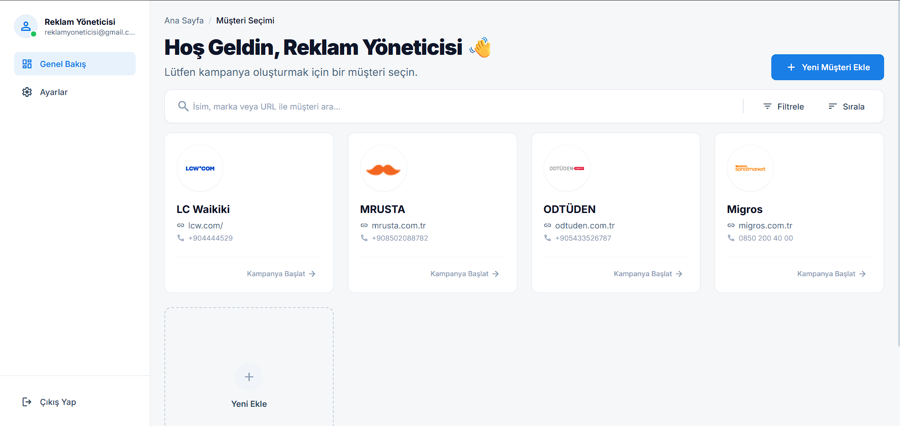

# 📖 User Guide

AI SMS Ad Generator - Turkish UI User Guide

---

## Table of Contents

- [Getting Started](#getting-started)
- [Creating an Account](#creating-an-account)
- [Logging In](#logging-in)
- [Customer Dashboard](#customer-dashboard)
- [Creating a Customer](#creating-a-customer)
- [Generating SMS Campaigns](#generating-sms-campaigns)
- [User Settings](#user-settings)
- [FAQ](#faq)

---

## Getting Started

The AI SMS Ad Generator helps you create professional SMS marketing campaigns using artificial intelligence. The system analyzes your customer's website to generate context-aware, engaging SMS drafts in Turkish.

### Main Features
- 🏢 **Customer Management**: Save and organize your clients
- 📱 **AI SMS Generation**: Create multiple SMS draft variations
- 🔒 **Secure Login**: Firebase authentication with email or Google
- ⚙️ **User Settings**: Customize your profile

---

## Creating an Account

1. Open the application at `http://localhost:5173`
2. On the login page, click **"Kayıt Ol"** (Sign Up)
3. Fill in the registration form:
   - **Görünen Ad**: Your display name
   - **E-posta**: Your email address
   - **Şifre**: Password (minimum 8 characters, must include uppercase, lowercase, and special character)
   - **Şifre Tekrar**: Confirm your password
4. Click **"Kayıt Ol"** button
5. You'll be redirected to the Dashboard

> **Password Requirements:**
> - Minimum 8 characters
> - At least 1 uppercase letter (A-Z)
> - At least 1 lowercase letter (a-z)
> - At least 1 special character (!@#$%^&*)

---

## Logging In

### Email/Password Login
1. Enter your **E-posta** (email)
2. Enter your **Şifre** (password)
3. Click **"Giriş Yap"** (Login)

### Google Login
1. Click **"Google ile Giriş Yap"** button
2. Select your Google account
3. Authorize the application

### Forgot Password
1. Click **"Şifremi Unuttum"**
2. Enter your email address
3. Check your email for reset instructions

---

## Customer Dashboard

The dashboard displays all your saved customers in a card grid layout.

> **TODO**: Add screenshot of Customer Dashboard here

### Dashboard Features

| Feature | Description |
|---------|-------------|
| **Müşteri Kartları** | View all customers with logo, name, and website |
| **Yeni Müşteri Ekle** | Add a new customer |
| **Ara...** | Search customers by name |
| **Sayfalama** | Navigate between pages (8 customers per page) |

### Customer Card Actions

Each customer card shows:
- Company logo (auto-extracted from website)
- Company name
- Website URL
- Phone number (if available)

Hover over a card to see action buttons:
- **Kampanya Başlat**: Start an SMS campaign for this customer
- **Düzenle**: Edit customer information
- **Sil**: Delete customer

---

## Creating a Customer

1. Click the **"+ Yeni Müşteri Ekle"** card or button
2. Fill in the customer form:
   - **Şirket Adı**: Company name (required)
   - **Web Sitesi**: Company website URL (required)
   - **Telefon Numarası**: Contact phone number (optional)
3. Click **"Kaydet"** (Save)

The system will automatically:
- Extract the company logo from the website
- Save the customer to your account

> **Note**: Logo extraction may not work for websites with bot protection (Cloudflare, etc.)

---

## Generating SMS Campaigns

### Starting a Campaign

1. On the Dashboard, find the customer card
2. Click **"Kampanya Başlat"** (Start Campaign)
3. You'll be taken to the SMS Generator with customer data pre-filled

### Campaign Configuration

| Field | Description |
|-------|-------------|
| **Web Sitesi URL** | Pre-filled from customer (read-only) |
| **Ürünler** | Products to promote (comma-separated) |
| **İndirim Oranı** | Discount percentage (e.g., 20) |
| **Hedef Kitle** | Target audience (e.g., "Gençler", "Aileler") |
| **Başlangıç Tarihi** | Campaign start date |
| **Bitiş Tarihi** | Campaign end date |
| **Mesaj Sayısı** | Number of SMS drafts to generate (1-10) |

### Generating Drafts

1. Fill in all required fields
2. Click **"Oluştur"** (Generate)
3. Wait for AI to generate SMS drafts
4. View generated drafts in the results panel

### SMS Draft Types

The AI generates different styles of SMS:

| Type | Description |
|------|-------------|
| **Klasik** | Standard promotional message |
| **Acil** | Urgency-focused message (e.g., "Son şans!") |
| **Dostça** | Friendly, casual tone with emojis |
| **Bilgilendirici** | Informative, detailed message |

### Copying SMS Drafts

Click on any generated draft to copy it to your clipboard.

---

## User Settings

Access settings by clicking your profile icon → **"Ayarlar"**

### Profile Settings

**Changing Display Name:**
1. Edit the **"Görünen Ad"** field
2. Click **"Kaydet"** (Save)
3. Your new name appears immediately in the navigation

**Changing Password:**
1. Enter your **Mevcut Şifre** (current password)
2. Enter your **Yeni Şifre** (new password)
3. Confirm with **Yeni Şifre Tekrar**
4. Click **"Şifreyi Değiştir"**

> **Note**: Password change requires re-authentication if you've been logged in for a while.

---

## FAQ

### General Questions

**Q: How does the AI generate SMS messages?**
A: The system uses Google Gemini AI to analyze your customer's website and generate contextually relevant SMS drafts in Turkish.

**Q: How many SMS can I generate at once?**
A: You can generate between 1-10 SMS drafts per request.

**Q: Are the SMS drafts in Turkish?**
A: Yes, all generated content is in Turkish with proper date formatting.

### Customer Management

**Q: Why doesn't my customer's logo appear?**
A: Some websites have bot protection (Cloudflare) that prevents logo extraction. The customer will still be saved with a placeholder image.

**Q: Can I edit a customer after creating?**
A: Yes, hover over the customer card and click the edit (pencil) icon.

### Technical Issues

**Q: I'm getting "429 Too Many Requests" error**
A: This means the AI service rate limit was exceeded. Wait a few seconds and try again.

**Q: The website scraping failed**
A: Some websites block automated access. Try entering product information manually.

**Q: I forgot my password**
A: Click "Şifremi Unuttum" on the login page to receive a password reset email.

---

## Need Help?

If you encounter issues not covered in this guide, please check:
- [README.md](./README.md) - Project overview and setup
- [SETUP_GUIDE.md](./SETUP_GUIDE.md) - Technical setup instructions
- [API_EXAMPLES.md](./API_EXAMPLES.md) - API documentation

---

> 💡 **Tip:** The AI works best when you provide detailed product names and specific target audience descriptions!
